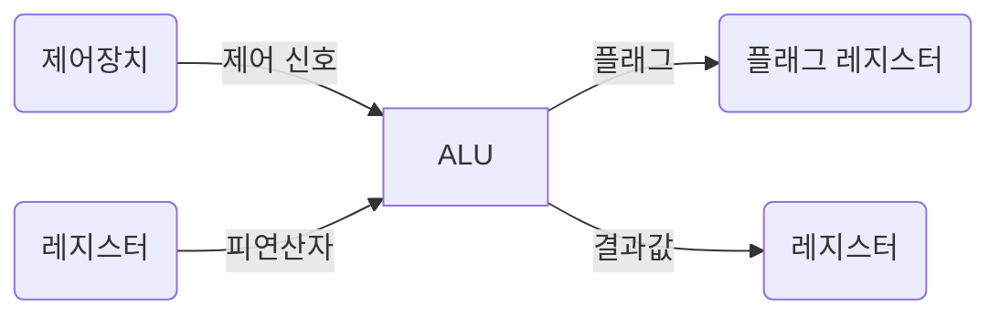
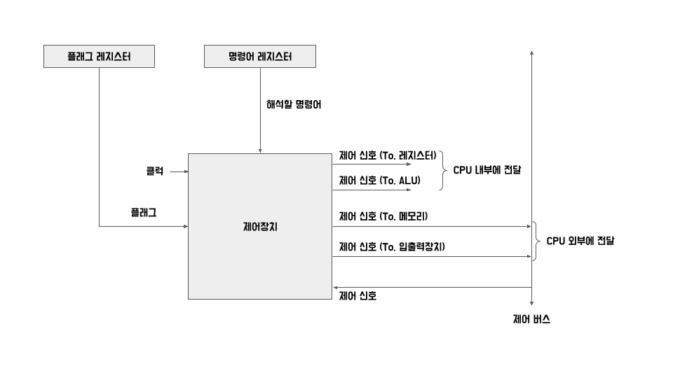

# 04-1. ALU와 제어장치

> [혼자 공부하는 컴퓨터구조 + 운영체제] 책.
>
> Chapter 04. CPU의 작동 원리

CPU 내부의 계산을 담당하는 ALU와 명령어를 읽어들이고 해석하는 제어장치가 받아들이고 내보내는 정보를 기준으로 각 부품의 역할을 설명하고, ALU와 제어장치가 무엇을 내보내고 무엇을 받아들이는지 학습한다.

## ALU (Arithmetic and Logical Unit, 산술 논리 장치)

ALU는 제어장치와 레지스터로부터 받아들인 피연산자와 제어 신호로 산술 연산, 논리 연산 등 다양한 연산을 수행한다. 이 결과값은 바로 메모리에 저장되지 않고 일시적으로 레지스터에 저장되는데 이는 레지스터에 접근하는 속도가 메모리에 접근하는 속도보다 빠르기 때문이다. ALU가 연산할 때마다 메모리에 저장한다면 더 느린 속도인 메모리에 접근을 더 자주하게 되고, 그에 따라 프로그램 실행 속도가 느려질 수 있다.

### 플래그

02장에서 "이진수만 봐서는 음수인지 양수인지 판단하기 어렵기 때문에 음수와 양수를 구분하기 위해 플래그를 사용한다."라고 했었다. 이처럼 때때로 ALU는 결과값 뿐만 아니라 연산 결과에 대한 추가적인 정보를 내보내야 할 때가 있다. (연산결과가 음수일 때, 연산결과가 레지스터보다 클 때(=오버플로우))

| 플래그 종류       | 의미                                                         | 사용 예시                                                    |
| ----------------- | ------------------------------------------------------------ | ------------------------------------------------------------ |
| 부호 플래그       | 연산한 결과의 부호를 나타낸다.                               | 부호 플래그가 1일 경우 계산 결과는 음수, 0일 경우 계산 결과는 양수를 의미한다. |
| 제로 플래그       | 연산 결과가 0인지 여부를 나타낸다.                           | 제로 플래그가 일 경우 연산결과는 0, 0일 경우 연산 결과는 0이 아님을 의미한다. |
| 캐리 플래그       | 연산 결과 올림수나 빌리수가 발생했는지를 나타낸다.           | 캐리 플래그가 1일 경우 올림수나 빌림수가 발생했음을 의미하고, 0일 경우 발생하지 않았음을 의미한다. |
| 오버플로우 플래그 | 오버플로우가 발생했는지를 나타낸다.                          | 오버플로우 플래그가 1일 경우 인터럽트가 가능함을 의미하고, 0일 경우 인터럽트가 불가능함을 의미한다. |
| 인터럽트 플래그   | 인터럽트가 가능한지를 나타낸다. 인터럽트는 04-3절에서 설명한다. | 인터럽트 플래그가 1일 경우 인터럽트가 가능함을 의미하고, 0일 경우 인터럽트가 불가능함을 의미한다. |
| 슈퍼바이저 플래그 | 커널 모드로 실행 중인지, 사용자 모드로 실행 중인지를 나타낸다. 커널모드와 사용자 모드는 09장에서 설명한다. | 슈퍼바이저 플래그가 1일 경우 커널모드로 실행 중임을 의미하고, 0일 경우 사용자 모드로 실행 중임을 의미한다. |

이러한 플래그는 CPU가 프로그램을 실행하는 도중 반드시 기억해야 하는 일종의 참고 정보이다. 그리고 플래그들은 플래그 레지스터라는 레지스터에 저장된다.

## 제어장치

**제어장치** : 제어신호를 내보내고, 명령어를 해석하는 부품.

**제어신호** : 컴퓨터 부품들을 관리하고 작동시키기 위한 일종의 전기 신호.

#### 첫째. 제어장치는 클럭 신호를 받아들인다.

**클럭** : 컴퓨터의 모든 부품을 일사불란하게 움직일 수 있게 하는 시간 단위.

클럭의 주기에 맞춰 한 레지스터에서 다른 레지스터로 데이터가 이동되거나, ALU에서 연산이 수행되거나, CPU가 메모리에 저장된 명령어를 읽어들이는 것.

다만, "컴퓨터의 모든 부품이 클럭 신호에 맞춰 작동한다"는 말은 "컴퓨터의 모든 부품이 한 클럭마다 작동한다"라고 이해하면 안된다. 컴퓨터 부품들은 클럭이라는 박자에 맞춰 작동할 뿐 한 박자마다 작동하는 것은 아니며, 하나의 명령어가 여러 클럭에 걸쳐 실행될 수 있다.

#### 둘째. 제어장치는 '해석해야 할 명령어'를 받아들인다.

CPU가 해석해야 할 명령어는 **명령어 레지스터**라는 특별한 레지스터에 저장된다. 제어장치는 이 명령어 레지스터로부터 해석할 명령어를 받아들이고 해석한 뒤, 제어 신호를 발생시켜 컴퓨터 부품들에 수행해야 할 내용을 알려준다.

#### 셋째. 제어장치는 플래그 레지스터 속 플래그 값을 받아들인다.

플래그는 ALU 연산에 대한 추가적인 상태 정보로 제어 장치가 부품들을 제어할 때 무시해서는 안되는 참고사항이다.

#### 넷째. 제어장치는 시스템 버스, 그 중에서 제어 버스로 전달된 제어신호를 받아들인다.

제어 신호는 CPU 뿐만 아니라 입출력장치를 비롯한 CPU 외부 장치도 발생시킬 수 있다. 이런 제어 신호를 제어 버스를 통해 외부로부터 받아들인다.

#### 제어장치가 내보내는 정보

**CPU 외부에 전달** : 제어버스로 제어 신호를 내보낸다. 메모리에 전달할 수도 있고 입출력장치에 전달할 수도 있다.

**CPU 내부에 전달** : ALU에 전달하는 제어 신호(수행할 연산을 지시하기 위해), 레지스터에 전달하는 제어신호(레지스터 간에 데이터를 이동시키거나 레지스터에 저장된 명령어를 해석하기 위해)가 있다.